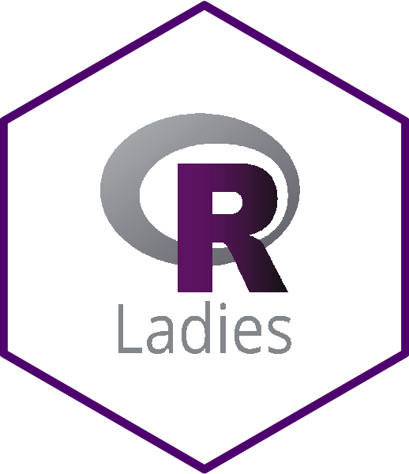
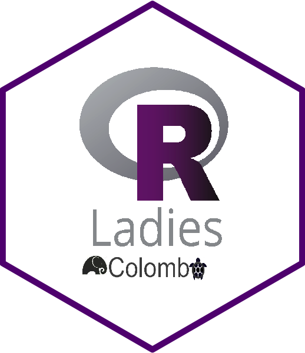
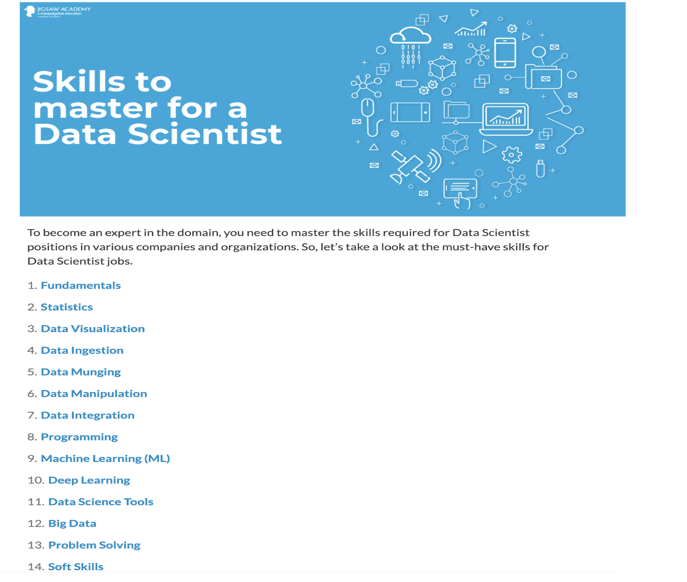
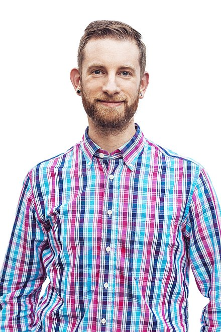
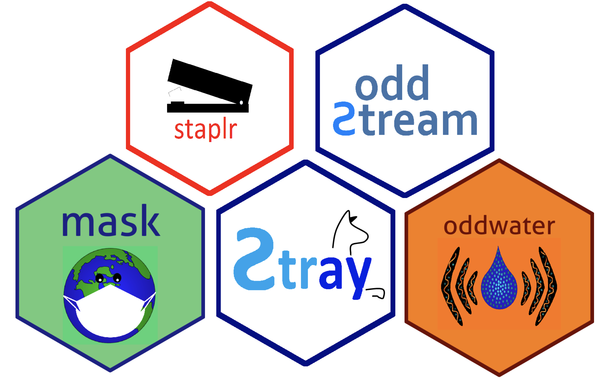
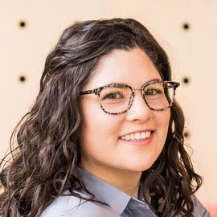

class: middle center bg-main1

# R-Ladies


## R-Ladies is a world-wide organization to promote gender diversity in the R community.


---
background-image: url(map.png)
background-position: center
background-size: contain

class: center, middle


---
class:  middle center bg-main1

.pull-left[

## R-Ladies Global, San Francisco, CA

```{r   out.width = "30%", echo = FALSE, fig.cap=''}

```

```{r, echo=FALSE}
icon::fa("globe")
```
https://rladies.org/

```{r, echo=FALSE}
icon::fa("twitter")
```
@RLadies

]

.pull-right[


## R-Ladies Colombo

```{r   out.width = "30%", echo = FALSE, fig.cap=''}

```

```{r, echo=FALSE}
icon::fa("globe")
```
https://rladiescolombo.netlify.app/

```{r, echo=FALSE}
icon::fa("twitter")
```

@RLadiesColombo

```{r, echo=FALSE}
icon::fa("envelope")
```

colombo@rladies.org


]

---
class: middle center bg-main1

# Code of conduct

R-Ladies is dedicated to providing a harassment-free experience for EVERYONE.

To ensure a safe, enjoyable, and friendly experience for everyone who participates, we follow the [R-Ladies International Code of Conduct.](https://rladies.org/code-of-conduct/#:~:text=R%2DLadies%20is%20dedicated%20to,of%20participants%20in%20any%20form.&text=Anyone%20who%20violates%20this%20code,of%20the%20Global%20Leadership%20Team.)

This code of conduct applies to all R-Ladies spaces, including meetups, Twitter, Slack, mailing lists, both online and offline.

---
class: middle center bg-main1

# Data Visualization


.pull-left[




source: https://towardsai.net/p/careers/know-what-employers-are-expecting-for-a-data-scientist-role-in-2020-65ad68553cc4

]

--
.pull-right[

```{r, comment=NA, echo=FALSE, fig.height=8, warning=FALSE, message=FALSE}
#### Top twenty skills required for data science jobs

library(DSjobtracker)
library(tidyr)
library(magrittr)
library(dplyr)
library(ggplot2)
library(viridis)
library(forcats)
theme_set(theme_minimal())
skills_long <- DStidy %>%
  select(c(R:Bahasa_Malaysia)) %>%
  pivot_longer(c(R:Bahasa_Malaysia), values_to = "Value", names_to = "Name") %>%
  mutate(Value = as.numeric(levels(Value))[Value]) %>%
  group_by(Name) %>%
  summarize(Total = sum(Value)) %>%
  arrange(Total)
p<- skills_long %>%
  mutate(Name = factor(Name, levels = .$Name)) %>%
  top_n(20) %>%
  ggplot(aes(x = Name, y = Total)) +
  geom_bar(stat = "identity") +
  geom_label(aes(label = Total),
    nudge_y = -10, size = 5,
    label.padding = unit(0.125, "lines")
  ) +
  coord_flip() +
  labs(
    x = "Skill Required", y = "No of job vacancies"
  )+
  theme(text = element_text(size=20))
print (p)

```


]


---

class: middle center bg-main1

.pull-left[


```{r   out.width = "80%", echo = FALSE, fig.cap=''}

```


**The greatest value of a picture is when it focus us to notice what we never expected to see.**

--

John Wilder Tukey

]

--

.pull-left[

```{r   out.width = "50%", echo = FALSE, fig.cap=''}

```

Hadley Wickham

The recipient of the 2006 John Chambers Award for Statistical Computing, and in 2019 he received the prestigious COPSS Presidents’ Award for his “influential work in statistical computing, visualization, graphics, and data analysis” including “making statistical thinking and computing accessible to a large audience.”
]

---
class: center

## Our Speaker

.pull-left[


### Priyanga Dilini Talagala

#### PhD, Monash University, Australia.

<i class="fas  fa-globe "></i>
prital.netlify.app

<i class="fab  fa-github "></i><i class="fab  fa-twitter "></i>
pridiltal

]

.pull-right[





]


---
# Number of R packages submitted to CRAN

```{r, comment=NA, message=FALSE, cache=TRUE}
library(rvest)
pkgs <- read_html("https://cran.r-project.org/web/packages/available_packages_by_name.html")
mylines <- pkgs %>% 
    html_nodes("tr") %>%
    xml_text()
nb_pkgs <- length(which(sapply(mylines, nchar)>5))
print(paste("There are", nb_pkgs, "packages available in CRAN as of", Sys.Date()))

```

---

background-image: url(1topdownloads.png)
background-position: center
background-size: contain

class: center, middle

---

background-image: url(2topdownloads.png)
background-position: center
background-size: contain

class: center, middle

---

background-image: url(3topdownloads.png)
background-position: center
background-size: contain

class: center, middle


---
## Top 20 downloaded R packages (from 26/12/ 2020 to 26/1/2021)

```{r, comment=NA, message=FALSE, echo=FALSE, fig.height=10, fig.width=18}
library(dplyr)
library(tidyr)
library(ggplot2)
library(cranlogs)
library(ggtextures) # devtools::install_github("clauswilke/ggtextures")
library(extrafont)
library(ggforce)
top_20_month <- cran_top_downloads(when="last-month", count = 20)
top_20_month <- top_20_month %>% mutate( ToHighlight = ifelse( package == "ggplot2", "yes", "no" ) )
ggplot(top_20_month, 
       aes(y = reorder(package, count), x = count)) +
        geom_bar(stat="identity", fill = "#66a61e") + ylab("Package name") + xlab("Number of downloads") + 
  theme(text=element_text(size=30))
# low to high order
#ggplot(top_20_month, 
#       aes(y = reorder(package, -count), x = count)) +
#        geom_bar(stat="identity")


```


---
## Top 20 downloaded R packages (from 26/12/ 2020 to 26/1/2021)


```{r, comment=NA, message=FALSE, echo=FALSE, fig.height=10, fig.width=18}
library(dplyr)
library(tidyr)
library(ggplot2)
library(cranlogs)
library(ggtextures) # devtools::install_github("clauswilke/ggtextures")
library(extrafont)
library(ggforce)
top_20_month <- cran_top_downloads(when="last-month", count = 20)
top_20_month <- top_20_month %>% mutate( ToHighlight = ifelse( package == "ggplot2", "yes", "no" ) )
ggplot(top_20_month, 
       aes(y = reorder(package, count), x = count, fill=ToHighlight)) +
        geom_bar(stat="identity") + ylab("Package name") + xlab("Number of downloads") + scale_fill_manual( values = c( "yes"="#e7298a", "no"="#66a61e" ), guide = FALSE ) + 
  theme(text=element_text(size=30))
# low to high order
#ggplot(top_20_month, 
#       aes(y = reorder(package, -count), x = count)) +
#        geom_bar(stat="identity")


```

---
background-image: url(tidydev.jpeg)
background-position: center
background-size: contain

## Tidyverse dev day at useR! 2019 - Toulouse, France

---
background-image: url(pic.jpeg)
background-position: center
background-size: contain

## Tidyverse dev day at useR! 2019 - Toulouse, France

---
background-image: url(bannar.jpeg)
background-position: center
background-size: contain


`r anicon::faa('bell', animate='shake', size=5)`

---
class: middle center bg-main1

```{r, echo=FALSE}
anicon::faa("bell", animate="ring", size=5)
```

## Next meetup: `Map creation with R`



### Monash University/ QUT, Australia

---

<blockquote class="twitter-tweet"><p lang="en" dir="ltr">Republicans like to show off a map 🗺 of the country being red, but it’s mostly empty space.<br><br>Land doesn’t vote.<br><br>People do.<a href="https://twitter.com/hashtag/ThursdayThoughts?src=hash&amp;ref_src=twsrc%5Etfw">#ThursdayThoughts</a> <a href="https://twitter.com/hashtag/ElectionResults2020?src=hash&amp;ref_src=twsrc%5Etfw">#ElectionResults2020</a> <a href="https://t.co/6QKgWJzwjZ">pic.twitter.com/6QKgWJzwjZ</a></p>&mdash; David Leavitt (@David_Leavitt) <a href="https://twitter.com/David_Leavitt/status/1324354262030262272?ref_src=twsrc%5Etfw">November 5, 2020</a></blockquote> <script async src="https://platform.twitter.com/widgets.js" charset="utf-8"></script>


---
class: middle center bg-main1

# Thank you

```{r   out.width = "30%", echo = FALSE, fig.cap=''}

```


```{r, echo=FALSE}
anicon::faa("leaf", animate="spin", size=5)
```

We would appreciate if you would take our brief survey about your experience with today's workshop.
We value your input and appreciate your feedback.


