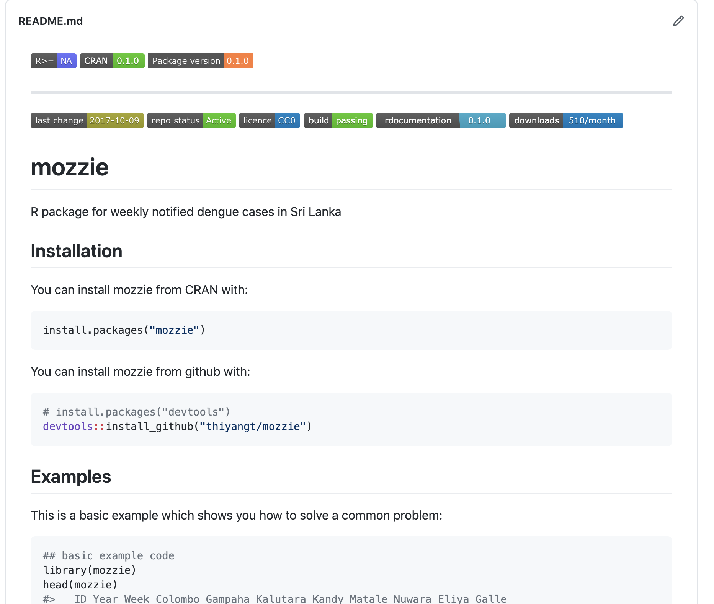
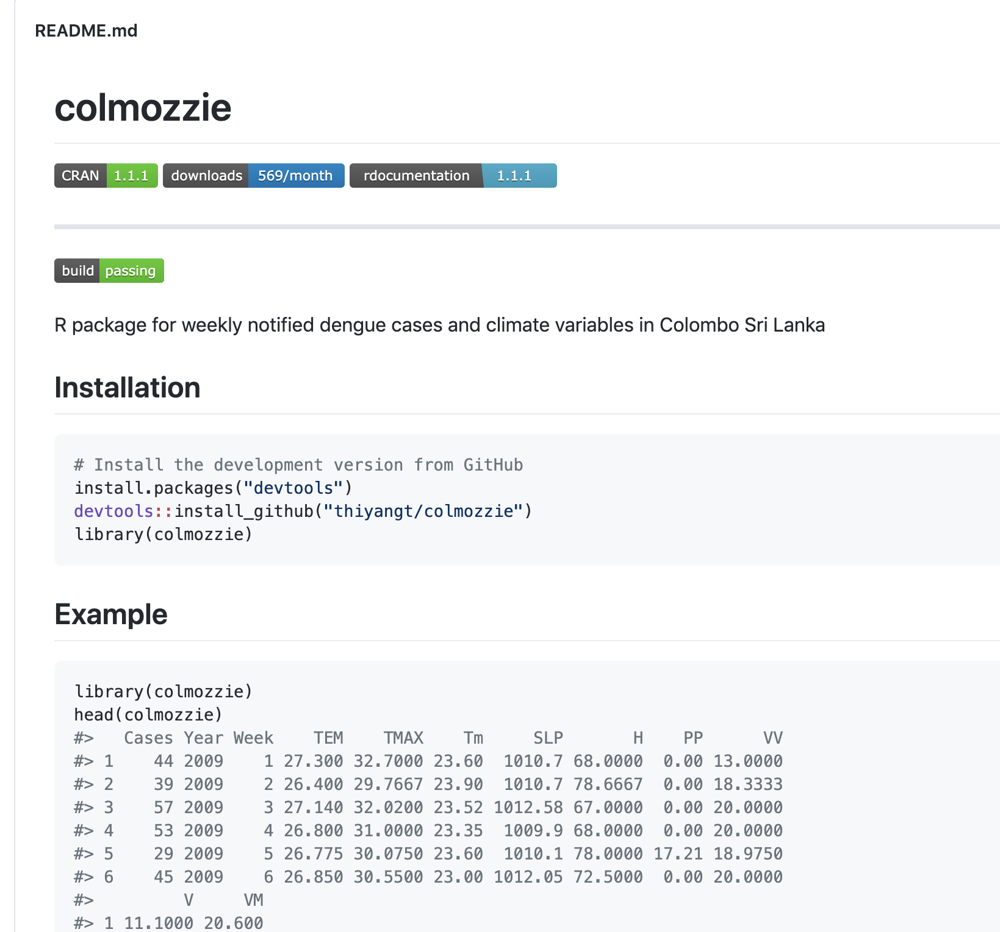
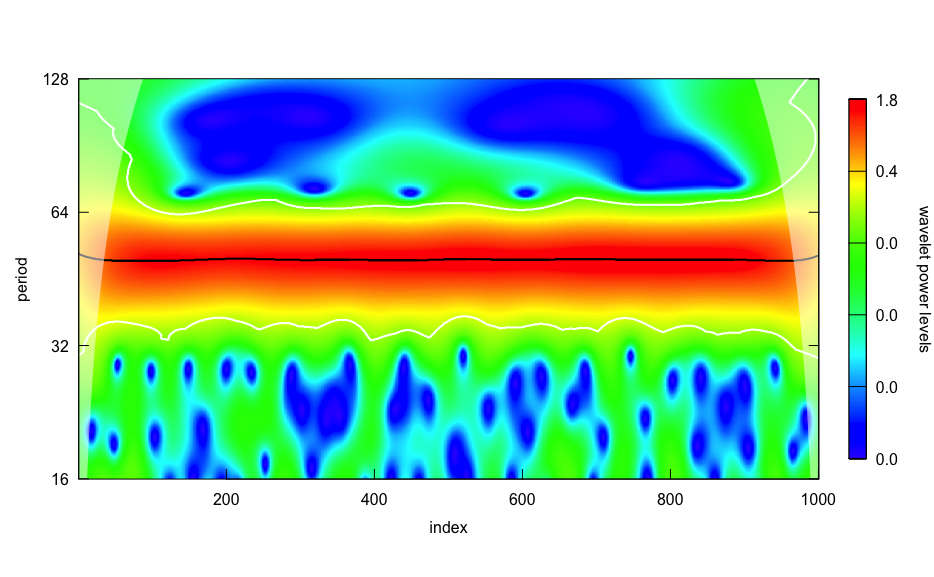
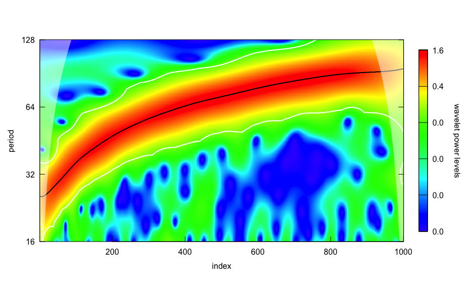
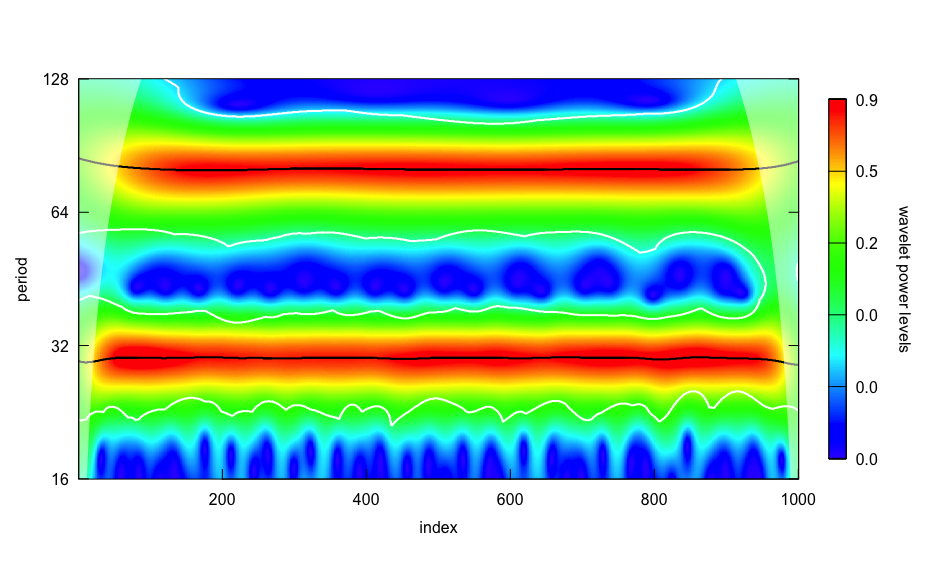
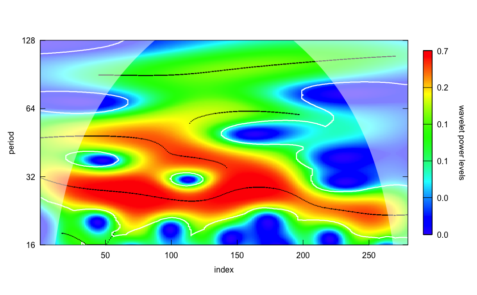
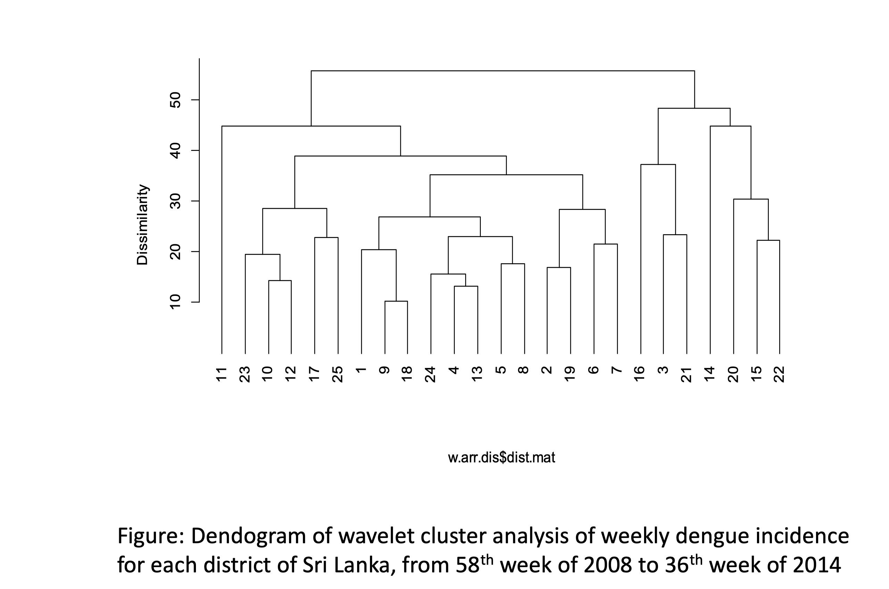

## About me

1. BSc (Hons) Statistics, University of Sri Jayewardenepura

2. MSc in Financial Mathematics, University of Moratuwa

3. PhD in Statistics, Monash University, Australia

--

## Current positions

Senior Lecturer, Department of Statistics, Faculty of Applied Sciences, University of Sri Jayewardenepura

--

Co-founder and co-organizer, R-Ladies Colombo, (local chapter of R-Ladies Global, USA)

--

Associate Investigator of the Australian Research Council (ARC) Centre of Excellence for Mathematical and Statistical Frontiers (ACEMS)

--

### Research interests

Time series forecasting, Data visualisation, Computational Statistics, Statistical Machine Learning, Data Mining

---

### Mathematical Modelling of Dengue Dynamics and Climate Variability in Sri Lanka

## Two awards

1. Bronze Medal at the Best Postgraduate Research Project Award Competition organized by the Institute of Applied Statistics, Sri Lanka 

2. Special Recognition award from the University of Moratuwa for winning the Bronze Medal at the Best Postgraduate Research Project Award Competition organized by the Institute of Applied Statistics, Sri Lanka

## Publications

> Talagala, T. (2015). Distributed lag nonlinear modelling approach to identify relationship between climatic factors and dengue incidence in Colombo District, Sri Lanka. Epidemiology, Biostatistics and Public Health, 12(4).

> Talagala, T., & Lokupitiya, R. (2015). Wavelet analysis of dengue transmission pattern in Sri Lanka. International Journal of Mosquito Research, 2(4), 13-18.


---

## Software

.pull-left[

```r
install.packages("mozzie")
```

### 510/month



]


.pull-right[

```r
install.packages("colmozzie")
```

### 569/month



]

---

class: middle center bg-main1

# The Research Journey

--
# Mathematical Modelling of Dengue Dynamics and Climate Variability in Sri Lanka

--

### Background and Motivation

---

background-image: url(theme.png)
background-position: center
background-size: contain

---

background-image: url(map1.png)
background-position: center
background-size: contain

---

background-image: url(map2.png)
background-position: center
background-size: contain

---

background-image: url(1.png)
background-position: center
background-size: contain

---
background-image: url(2.png)
background-position: center
background-size: contain

---
background-image: url(3.png)
background-position: center
background-size: contain

---

background-image: url(4.png)
background-position: center
background-size: contain

---

background-image: url(5.png)
background-position: center
background-size: contain
---

background-image: url(6.png)
background-position: center
background-size: contain

---

class: middle center bg-main1

## Role of 

## Mathematical Modelling of Dengue Dynamics <br/><br/> and Climate Variability in Sri Lanka

## in Finance


---

background-image: url(7.png)
background-position: center
background-size: contain
---
background-image: url(8.png)
background-position: center
background-size: contain

---
background-image: url(9.png)
background-position: center
background-size: contain

---

background-image: url(10.png)
background-position: center
background-size: contain

---

background-image: url(11.png)
background-position: center
background-size: contain

---

background-image: url(12.png)
background-position: center
background-size: contain

---

background-image: url(13.png)
background-position: center
background-size: contain

---

background-image: url(14.png)
background-position: center
background-size: contain


---

background-image: url(15.png)
background-position: center
background-size: contain

---

background-image: url(16.png)
background-position: center
background-size: contain

---

background-image: url(17.png)
background-position: center
background-size: contain

---
class: middle center bg-main1

## An Actuarial Perspective on 

## Modelling of Dengue Dynamics and Climate Variability 

## on Insurers


---

background-image: url(18.png)
background-position: center
background-size: contain

---

background-image: url(19.png)
background-position: center
background-size: contain

---

background-image: url(20.png)
background-position: center
background-size: contain

---

background-image: url(21.png)
background-position: center
background-size: contain

---

## General Objectives

- To identify epidemiological outbreak pattern of DF/ DHF in each district of Sri Lanka.

- To identify and quantify the nonlinear, 
    nonstationary association between climatic factors and dengue counts.
    

    
## Specific objectives

- To identify periodic pattern in dengue counts and how it progress through time.

- To identify districts with similar dengue dynamic pattern.


- To identify nonstationary association between dengue counts and climate variables.

- To identify the delayed effect of climate variables on dengue incidence.


- To identify the nonlinear association between climate variables and dengue incidence.

- To determine whether there are change-points, where dynamics shifted transmission pattern in dengue and climate variables.


---

## Significance of the study

- Time for the allocation of resources

- Lagged observed climate variables could provide lead for forecasting disease epidemics

- Benefit for optimizing current dengue surveillance and control programmes

- Budget planning

---

# Data

.pull-left[

### Epidemiological data

Weekly notified dengue cases in 25 districts 

]

.pull-right[

### Climatic data


- Mean Temperature

- Maximum Temperature

- Minimum Temperature

- Mean humidity

- Precipitation amount

- Mean visibility

- Mean wind speed

- Maximum sustained wind speed

]

---

## Wavelet Analysis

- Wavelet transform: decompose a time series into a time dependent sum of frequency components.

- To identify seasonal oscillations with time-varying intensity and frequency.


---

## Wavelet Transform

- Shift a wavelet to the right until you have covered the whole signal.

- Scale (stretch) the wavelet and repeat


---
background-image: url(IMG_0558.PNG)
background-position: center
background-size: contain


---

### Time series 1

```{r, echo=FALSE, warning=FALSE, message=FALSE, fig.width=15, fig.height=3.5}
library(WaveletComp)
library(forecast)
library(tidyverse)
x=periodic.series(start.period=50, length=1000)
set.seed(1)
x=x+0.2*rnorm(1000)
y=as.ts(x)
autoplot(y)
```

--
.pull-left[




]

.pull-right[

### Wavelet power spectrum

]


```{r, echo=FALSE, message=FALSE, comment=NA, warning=FALSE, eval=FALSE}
my.data = data.frame(x=x)
my.w <- analyze.wavelet(my.data, "x", dt=1, dj=1/250,
                        lowerPeriod = 16, upperPeriod = 128,
                        make.pval = TRUE, n.sim = 10)
wt.image(my.w, color.key = "quantile", n.levels = 250,
legend.params = list(lab = "wavelet power levels", mar = 4.7), verbose = FALSE)
```


---

## Time series: non-constant period

```{r, comment=NA, message=FALSE, warning=FALSE, fig.width=15, fig.height=3, echo=FALSE}
x = periodic.series(start.period = 20, end.period = 100, length = 1000)
set.seed(1)
x = x + 0.2*rnorm(1000)
y = as.ts(x)
autoplot(y)
```

```{r, eval=FALSE, echo=FALSE}
my.data <- data.frame(x = x)
my.w <- analyze.wavelet(my.data, "x",
loess.span = 0,
dt = 1, dj = 1/250,
lowerPeriod = 16,
upperPeriod = 128,
make.pval = TRUE, n.sim = 10)
wt.image(my.w, n.levels = 250,
legend.params = list(lab = "wavelet power levels"))

```

.pull-left[



]

.pull-right[

### Wavelet-power spectrum

]

---

## Time series: multiple-periodicity

```{r, comment=NA, message=FALSE, warning=FALSE, echo=FALSE, fig.height=3, fig.width=15}
x1 <- periodic.series(start.period = 80, length = 1000)
x2 <- periodic.series(start.period = 30, length = 1000)
x <- x1 + x2 + 0.2*rnorm(1000)
y <- as.ts(x)
autoplot(y)
```

.pull-left[

```{r, echo=FALSE, eval=FALSE}
my.data <- data.frame(x = x)
my.w <- analyze.wavelet(my.data, "x",
loess.span = 0,
dt = 1, dj = 1/250,
lowerPeriod = 16,
upperPeriod = 128,
make.pval = TRUE, n.sim = 10)
wt.image(my.w, n.levels = 250,
legend.params = list(lab = "wavelet power levels") )
```



]

.pull-right[

### Wavelet power spectrum


]

---

## Colombo District

```{r, comment=NA, message=FALSE, warning=FALSE, echo=FALSE, fig.width=15, fig.height=3}
library(mozzie)
data(mozzie)
autoplot(as.ts(mozzie$Colombo))

```

```{r, comment=NA, eval=FALSE, echo=FALSE}
my.data <- data.frame(x = sqrt(mozzie$Colombo))
my.w <- analyze.wavelet(my.data, "x",
loess.span = 0,
dt = 1, dj = 1/250,
lowerPeriod = 16,
upperPeriod = 128,
make.pval = TRUE, n.sim = 10)
wt.image(my.w, n.levels = 250,
legend.params = list(lab = "wavelet power levels") )
```

.pull-left[



]

.pull-right[

### Wavelet power spectrum

]

---

background-image: url(all.png)
background-position: center
background-size: contain

---

## Wavelet cluster analysis



---
background-image: url(c1.png)
background-position: center
background-size: contain

## Wavelet cluster analysis


---

background-image: url(c2.png)
background-position: center
background-size: contain

## Wavelet cluster analysis


---

background-image: url(c3.png)
background-position: center
background-size: contain

## Wavelet cluster analysis


---

background-image: url(c4.png)
background-position: center
background-size: contain

## Wavelet cluster analysis


---

background-image: url(c5.png)
background-position: center
background-size: contain

## Kalutara


---

background-image: url(c6.png)
background-position: center
background-size: contain

## Trincomale

---

# Wavelet Coherence Analysis

- Quantify the relationship between two nonstationary signals

- Quantify the phase relationship between two variables


---
background-image: url(climate.png)
background-position: center
background-size: contain

---


background-image: url(c1.png)
background-position: center
background-size: contain

---
background-image: url(c2.png)
background-position: center
background-size: contain


---
background-image: url(c3.png)
background-position: center
background-size: contain


---
background-image: url(c4.png)
background-position: center
background-size: contain

---

background-image: url(c5.png)
background-position: center
background-size: contain

---
background-image: url(c6.png)
background-position: center
background-size: contain


---

## Change Point Analysis (CPA)

- Method for detecting mean and/or variance shifts in a time series.

- To identify extreme effect of weather on dengue incidence.


---
background-image: url(d1.png)
background-position: center
background-size: contain


---
background-image: url(d2.png)
background-position: center
background-size: contain

---

background-image: url(d3.png)
background-position: center
background-size: contain

---

background-image: url(d4.png)
background-position: center
background-size: contain


---

## Distributed Lag-Nonlinear Models

- Simultaneously describe the **nonlinear** and **delayed (lag-effects)** dependencies.


---

background-image: url(d5.png)
background-position: center
background-size: contain

---

background-image: url(d6.png)
background-position: center
background-size: contain

---

## Conclusions

- Two peaks of the disease occur at annual and semi annual scale.

- Two clusters based on dengue dynamic pattern were identified.

- Except Kalutara and Trincomalee districts distribution of other districts among clusters may have influenced from monsoon winds.

- Dengue incidence showed significant coherence with all climatic factors but with different periodicities and phase relationships.

- Wavelet phase analysis revealed a lag difference between climate variables and dengue incidence.

- 22 change points were detected in the variation of dengue cases based on CPA.

- CPA revealed changes in the variation of dengue incidence was very much similar to the changes in precipitation, humidity and maximum temperature.

---

## Conclusions (cont.)

- DLNM revealed,

    - Mean Temperature 250C – 270C at lag 1 – 8 weeks
    - Precipitation > 70mm at lag 1- 5 weeks and 20- 50mm at  lag 10 – 20 weeks
    - Humidity 65% - 80% at lag 10 – 18 weeks
    - Visibility > 14 km
    
    have a **positive impact** on the occurrence of dengue incidence.
    
- DLNM revealed,

    - Mean Temperature > 280C at lag 6 – 25 weeks
    - Maximum Temperature lag 4 – 6 weeks
    - Precipitation > 65mm at lag 15 – 20 weeks
    - Humidity < 70% at lag 4 – 9 weeks
    - Visibility < 14km
    - Wind speed
    
    have a **negative impact** on the occurrence of dengue incidence.


---

## Current research areas

- Large-scale forecasting

- Anomaly detection

- Machine learning + Time series analysis

    - Forecasting numbers of claims.
    
    - Premium forecasting
    
    - Energy forecasting

- Data Visualisation

- Text-based data and forecasting


---

## Choosing a Topic & Framing a Research Question

- Read good journal articles

- Framing a Research Question

    - Motivation, Research gap, Objectives
    
    - Be clear about the boundaries and conditions of your research
    
    - Identify the potential limitations

- Make sure you stay up-to-date with the most recent developments in your field.


---


# Thank you


## Contact: ttalagala@sjp.ac.lk


