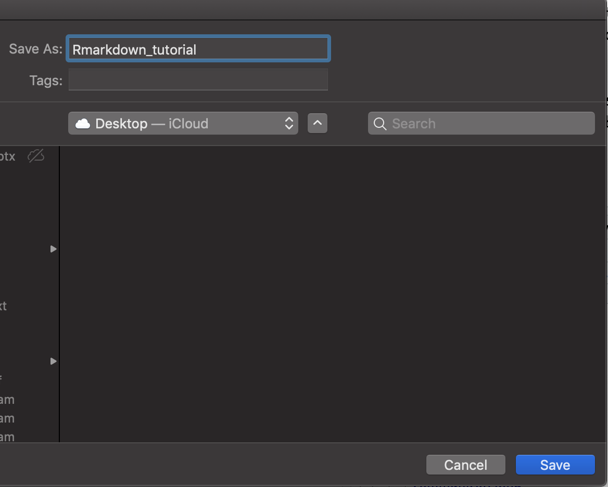

class: middle center bg-main1
---
background-image:url("screenshots/1img.png")
background-size: contain

---
background-image:url("screenshots/2img.png")
background-size: contain

---
background-image:url("screenshots/3img.png")
background-size: contain

---
background-image:url("screenshots/4img.png")
background-size: contain
---
background-image:url("screenshots/5img.png")
background-size: contain
---
background-image:url("screenshots/6img.png")
background-size: contain
---
background-image:url("screenshots/7img.png")
background-size: contain
---
background-image:url("screenshots/8img.png")
background-size: contain
---
background-image:url("screenshots/9img.png")
background-size: contain

---
background-image:url("screenshots/10img.png")
background-size: contain

---
background-image:url("screenshots/11img.png")
background-size: contain

---
background-image:url("screenshots/12img.png")
background-size: contain

---
background-image:url("screenshots/13img.png")
background-size: contain

---
background-image:url("screenshots/14img.png")
background-size: contain

---
background-image:url("screenshots/15img.png")
background-size: contain

---
background-image:url("screenshots/16img.png")
background-size: contain

---
background-image:url("screenshots/17img.png")
background-size: contain

---
class: middle center bg-main1

```{r, echo=FALSE}
anicon::faa("wrench", size=5)
```

# Creating an R Markdown document

---

background-image: url(rmarkdown_step1.png)
background-position: center
background-size: contain


---
background-image: url(rmarkdown_step2.png)
background-position: center
background-size: contain

---

background-image: url(rmarkdown_step2_1.png)
background-position: center
background-size: contain
---

background-image: url(rmarkdown_step3.png)
background-position: center
background-size: contain

class: center, middle


---

background-image: url(rmarkdown_step4.png)
background-position: center
background-size: contain

class: center, middle

---

# Select a folder to save the document 


---

# Give a name to the document



---

background-image: url(rmarkdown_step5.png)
background-position: center
background-size: contain

class: center, middle

---

background-image: url(rmarkdown_step6.png)
background-position: center
background-size: contain

class: center, middle

---

background-image: url(rmarkdown_step7.png)
background-position: center
background-size: contain

class: center, middle

---


<video width="100%" height="100%" controls id="sc1">
<source src="media/sc1.mp4" type="video/mp4">
</video>
  
---

# R Markdown pipeline


```{r echo=FALSE, out.width='100%'}

```

Image source: [here](https://rmarkdown.rstudio.com/authoring_quick_tour.html)


---
background-image:url("anatomy.jpeg")
background-size:contain

---

class: middle center bg-main1

```{r, echo=FALSE}
anicon::faa("leaf", animate="spin", size=5)
```

# Customizing your R Markdown document: text


---
background-image:url("sc1/c1.png")
background-size:contain

---

background-image:url("sc1/c2.png")
background-size:contain

---

background-image:url("sc1/c3.png")
background-size:contain

---

background-image:url("sc1/c4.png")
background-size:contain

---
background-image:url("sc1/c5.png")
background-size:contain

---

background-image:url("sc1/c6.png")
background-size:contain

---

background-image:url("sc1/c7.png")
background-size:contain

---

background-image:url("sc1/c8.png")
background-size:contain

---

background-image:url("sc1/c9.png")
background-size:contain

---

background-image:url("sc1/c13.png")
background-size:contain

---

background-image:url("sc1/c14.png")
background-size:contain

---

background-image:url("sc1/c15.png")
background-size:contain

---

class: middle center bg-main1

```{r, echo=FALSE}
anicon::faa("leaf", animate="spin", size=5)
```

# Customizing your R Markdown document: code chunk

---

background-image:url("sc1/c17.png")
background-size:contain

---

class: middle center bg-main1


# Anatomy of R Markdown

## code chunk

---


background-image:url("sc1/c18.png")
background-size:contain

---

class: middle center bg-main1


# Anatomy of R Markdown

## Text

---

background-image:url("sc1/c20.png")
background-size:contain

---

class: middle center bg-main1

# Anatomy of R Markdown

## YAML

### HTML Document

---

background-image:url("sc1/c19.png")
background-size:contain

---

class: middle center bg-main1

# Anatomy of R Markdown

## YAML

### PDF Document


---

background-image:url("sc1/SC/s1.png")
background-size:contain

---

background-image:url("sc1/SC/s2.png")
background-size:contain

---

class: middle center bg-main1

# Anatomy of R Markdown

## YAML

### Word Document


---

background-image:url("sc1/SC/s3.png")
background-size:contain

---

background-image:url("sc1/SC/s4.png")
background-size:contain

---

class: middle center bg-main1

# Chunk options

---

background-image:url("sc1/SC/s5.png")
background-size:contain

## fig.width/ fig.height

---
background-image:url("sc1/SC/s7.png")
background-size:contain

## fig.width/ fig.height

---

background-image:url("sc1/SC/s6.png")
background-size:contain

## echo [TRUE/ FALSE]


---

background-image:url("sc1/SC/s8.png")
background-size:contain

## eval [TRUE/ FALSE]

---

class: middle center bg-main1

# Styling your R Markdown document

## YAML

---
background-image:url("sc1/SC/s9.png")
background-size:contain

## toc: true

---

background-image:url("sc1/SC/s10.png")
background-size:contain

## toc_float: true

---

background-image:url("sc1/SC/s11.png")
background-size:contain


---

background-image:url("sc1/SC/s12.png")
background-size:contain

---

background-image:url("sc1/SC/s13.png")
background-size:contain

---

background-image:url("sc1/SC/s14.png")
background-size:contain

## number_sections

---

background-image:url("sc1/SC/s15.png")
background-size:contain

---
background-image:url("sc1/SC/s16.png")
background-size:contain

---
class: middle center bg-main1

# Styling your R Markdown document

## theme


---
background-image:url("sc1/SC/s17.png")
background-size:contain

---

background-image:url("sc1/SC/s18.png")
background-size:contain


---

background-image:url("sc1/SC/s19.png")
background-size:contain

---

background-image:url("sc1/SC/s20.png")
background-size:contain

---
class: middle center bg-main1

# Styling your R Markdown document

## highlight

---

background-image:url("sc1/SC/s21.png")
background-size:contain

---

background-image:url("sc1/SC/s22.png")
background-size:contain

---

class: middle center bg-main1

# Styling your R Markdown document

## Tabbed Sections


---

background-image:url("sc1/SC/s23.png")
background-size:contain

---

background-image:url("sc1/SC/s24.png")
background-size:contain

---

class: middle center bg-main1

# R Markdown to R script


---

background-image:url("sc1/SC/s25.png")
background-size:contain

---

background-image:url("sc1/SC/s26.png")
background-size:contain

---


background-image:url("sc1/SC/s27.png")
background-size:contain

---

background-image:url("sc1/SC/s28.png")
background-size:contain

---

class: middle center bg-main1

# R script to R Markdown

## Method 1 (Using Rstudio)

---


background-image:url("sc1/SC/s29.png")
background-size:contain


---

background-image:url("sc1/SC/s30.png")
background-size:contain

---

background-image:url("sc1/SC/s30-1.png")
background-size:contain

---


background-image:url("sc1/SC/s31.png")
background-size:contain

---


background-image:url("sc1/SC/s32.png")
background-size:contain

---

class: middle center bg-main1

# R script to R Markdown

## Method 1 (Using Rstudio)

---

class: middle center bg-main1

# Document your Analysis

---


background-image:url("sc1/SC/s33.png")
background-size:contain


---

background-image:url("sc1/SC/s34.png")
background-size:contain


---

background-image:url("sc1/SC/s35.png")
background-size:contain

---


background-image:url("sc1/SC/s36.png")
background-size:contain

---


background-image:url("sc1/SC/s37.png")
background-size:contain

---


background-image:url("sc1/SC/s38.png")
background-size:contain

---

class: middle center bg-main1

# Include Latex tables

---

background-image:url("sc1/SC/s39.png")
background-size:contain

---
class: middle center bg-main1

# Include images

---

background-image:url("sc1/SC/s40.png")
background-size:contain

---

background-image:url("sc1/SC/s41.png")
background-size:contain

---

background-image:url("sc1/SC/s42.png")
background-size:contain

---

class: middle center bg-main1

# Parameterized R Markdown

---


