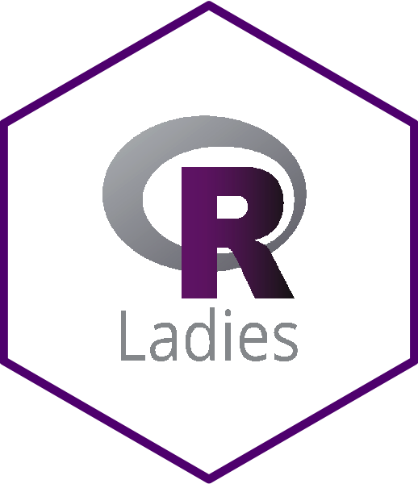
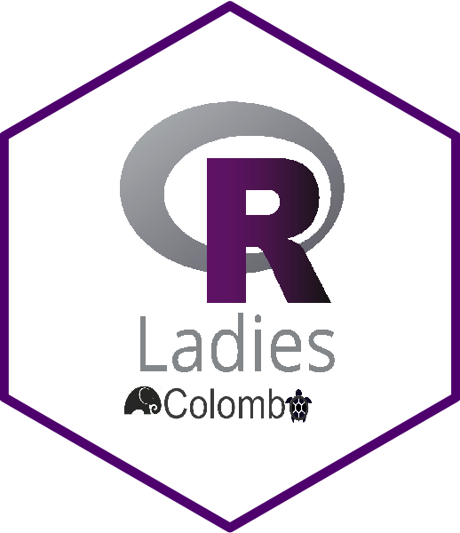

class: middle center bg-main1

# R-Ladies


## R-Ladies is a world-wide organization to promote gender diversity in the R community.


---
background-image: url(shiny.png)
background-position: center
background-size: contain

class: center, middle


---
class:  middle center bg-main1

.pull-left[

## R-Ladies Global, San Francisco, CA

```{r   out.width = "30%", echo = FALSE, fig.cap=''}

```

```{r, echo=FALSE}
icon::fa("globe")
```
https://rladies.org/

```{r, echo=FALSE}
icon::fa("twitter")
```
@RLadies

]

.pull-right[


## R-Ladies Colombo

```{r   out.width = "30%", echo = FALSE, fig.cap=''}

```

```{r, echo=FALSE}
icon::fa("globe")
```
https://rladiescolombo.netlify.app/

```{r, echo=FALSE}
icon::fa("twitter")
```

@RLadiesColombo

```{r, echo=FALSE}
icon::fa("envelope")
```

colombo@rladies.org


]

---
class: middle center bg-main1

# Code of conduct

R-Ladies is dedicated to providing a harassment-free experience for EVERYONE.

To ensure a safe, enjoyable, and friendly experience for everyone who participates, we follow the [R-Ladies International Code of Conduct.](https://rladies.org/code-of-conduct/#:~:text=R%2DLadies%20is%20dedicated%20to,of%20participants%20in%20any%20form.&text=Anyone%20who%20violates%20this%20code,of%20the%20Global%20Leadership%20Team.)

This code of conduct applies to all R-Ladies spaces, including meetups, Twitter, Slack, mailing lists, both online and offline.


---
background-image:url(samudra.png)
background-size: contain
class: center


