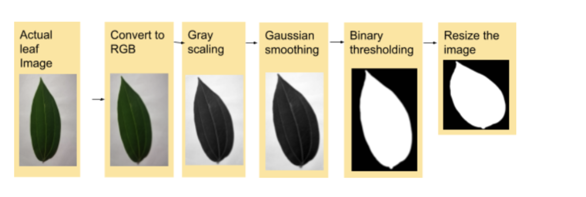
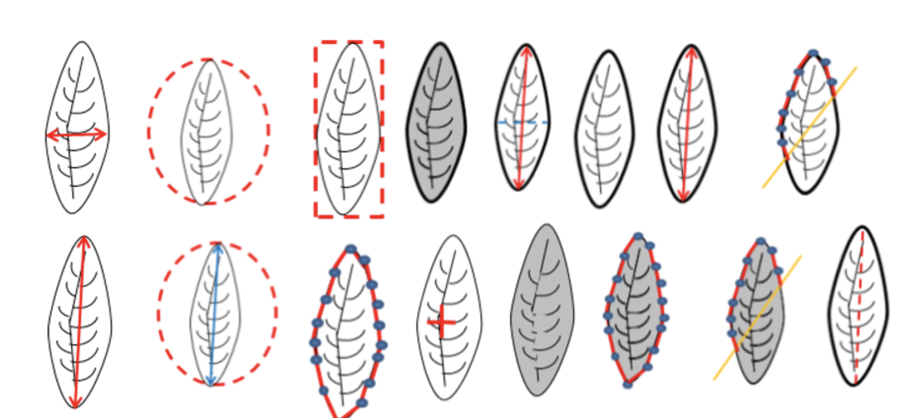
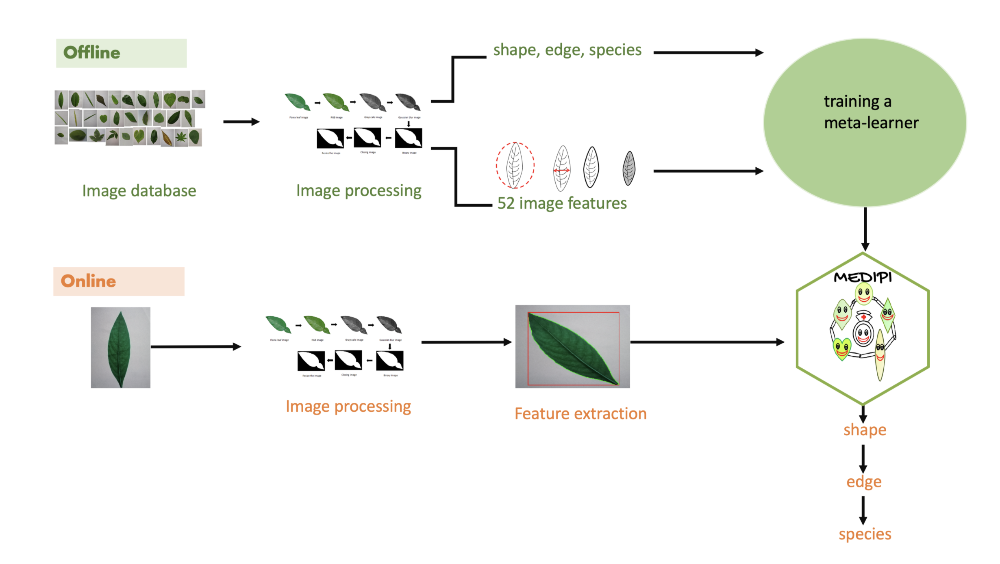
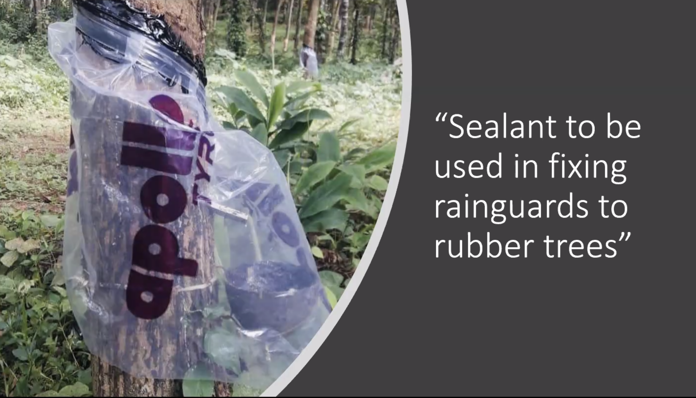
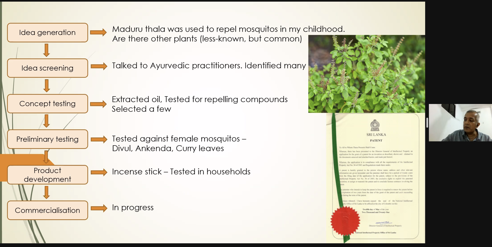
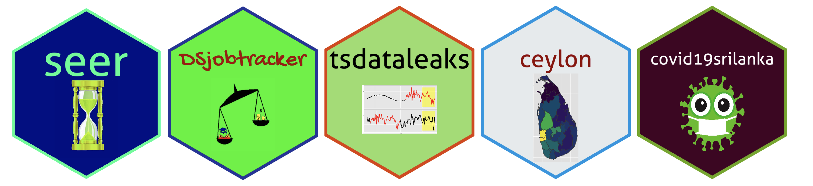

```{r setup, include=FALSE}
options(htmltools.dir.version = FALSE)
knitr::opts_chunk$set(
  fig.width=9, fig.height=3.5, fig.retina=3,
  out.width = "100%",
  cache = FALSE,
  echo = TRUE,
  message = FALSE, 
  warning = FALSE,
  fig.show = TRUE,
  hiline = TRUE
)
```

```{r xaringan-themer, include=FALSE, warning=FALSE}
library(xaringanthemer)
style_mono_accent(
  base_color = "#081d58",
  text_bold_color = "#ce1256",
  title_slide_text_color = "#edf8b1",
  header_font_google = google_font("Josefin Sans"),
  base_font_size = "18px",
  text_font_size = "1.5rem",
 # code_inline_font_size = "1em",
  code_font_size="1em"
 #text_font_google   = google_font("Montserrat", "300", "300i")
 # code_font_google   = google_font("Fira Mono")
)
```


class: middle, center

# **Data science:** a game changer for science and innovation

---

background-image: url(f1.png)
background-position: center
background-size: contain

class: center, middle

---

background-image: url(f2.png)
background-position: center
background-size: contain

class: center, middle

---

background-image: url(f3.png)
background-position: center
background-size: contain

class: center, middle

---
background-image: url(f4.png)
background-position: center
background-size: contain

class: center, middle

---


## Algorithm

a set of instructions used to solve a problem

--

**MEDIPI** (**MEDI**icinal **P**lant **I**dentification) algorithm



---

**MEDIPI** (**MEDI**icinal **P**lant **I**dentification) algorithm


---

**MEDIPI** (**MEDI**icinal **P**lant **I**dentification) algorithm


---

**MEDIPI** (**MEDI**icinal **P**lant **I**dentification) algorithm



---

class: middle, center

# Can you patent an algorithm?

---
background-image: url(p1.png)
background-position: center
background-size: contain

---

### Largest machine learning and artificial intelligence (AI) patent owners - 2020


```{r, comment=NA, echo=FALSE}
library(ggplot2)
df <- data.frame(owner=c("IBM", "Samsung",
                         "Microsoft", "Chinese Academy of Sciences", "State Grid Crop", "Baidu", "Tencent", "Alphabet", "Ping An Insurance", "Intel"), count = c(5538, 5498, 5052, 4572, 4375, 3977, 3944, 3354, 3056, 3001))
df$owner <- factor(df$owner, levels=rev(c("IBM", "Samsung",
                         "Microsoft", "Chinese Academy of Sciences", "State Grid Crop", "Baidu", "Tencent", "Alphabet", "Ping An Insurance", "Intel")))
ggplot(data=df, aes(y=owner, x=count)) +
  geom_bar(stat="identity") 
```


Data: https://www.statista.com/statistics/1062360/autonomous-driving-patent-owners-japanese-authority/

---
class: middle, center

# Facebook: Scan photos for brands and see what products you like

---
background-image: url(frenchfries.jpg)
background-position: center
background-size: contain

---

class: middle, center

# Better change of securing a patent

---
background-image: url(bp.jpg)
background-position: center
background-size: contain


---

- Model building: Given data predict the  likelihood of **Preeclampsia** (a pregnancy complication characterized by high blood pressure and signs of damage to another organ system, most often the liver and kidneys)

$$Y = f(X)$$


- Incorporate this into the device to generate an alert when the likelihood of having  Preeclampsia is high.

---
class: middle, center

# Role of Statisticians

---

class: inverse

# Prof. Laleen Karunanayake




---

class: inverse

# Prof. Upul Subasinghe 



---
# Statistics: The Science of Data

1. Data collection

  - Design of Experiments
  
2. Data visualization
  
3. Data analysis

4. Interpretation of Results

---
class: middle, center

## Open Science

"the movement **to make scientific research (including publications, data, physical samples, and software) and its dissemination accessible to all levels of society**, amateur or professional"

source: https://en.wikipedia.org/wiki/Open_science

---
class: middle, center

## Reproducibility

"Reproducible research is the idea that data analyses, and more generally, scientific claims, are published with their data and software code so that others may verify the findings and build upon them."

source: https://www.coursera.org/learn/reproducible-research

---
## Open source software authored by me

`tea`: R package for tea exporting countries

`mozzie`: R package for dengue cases in Sri Lanka

`colmozzie`: R package for dengue cases and climate variables in Colombo Sri Lanka

`m4comp2018`: R package for M4 Competition time series data

`DSjobtracker`: R package containing information related to data science job advertisements. What skills and qualifications are required for data science related jobs?

`MedLEA`: The MedLEA package provides morphological and structural features of 471 medicinal plant leaves and 1099 leaf images of 31 species and 29-45 images per species.


---

## Open source software authored by me

`ceylon`: An R package to plot maps of Sri Lanka


`covid19srilanka`: An R package to get tidy format dataset of the 2019 Novel Coronavirus COVID-19 (2019-nCoV) epidemic in Sri Lanka.


`seer`: R package for feature-based time series forecasting.

`tsfeatures`: R package tsfeatures provides methods for extracting various features from time series data.

`explainer`: Take a peek inside a random forest.

`tsdataleaks`: R Package for detecting data leakages in time series forecasting competitions.

`nic`: Nature inspired colour palette for data visualization.

---

# Impact

## `seer` package downloads

```{r, comment=NA, echo=FALSE, cache=TRUE}
library("ggplot2")
library("dlstats")

x <- cran_stats(c("seer"))

if (!is.null(x)) {
   head(x)
   ggplot(x, aes(end, downloads, group=package, color=package)) +
       geom_line() + geom_point(aes(shape=package))
}

```

---

# Small things matter a lot!

- Give it a catchy name

- Add a logo



---
class: center, middle

# Thank You!

```{r, echo=FALSE}
anicon::faa("twitter", animate="float", size=3, colour="lightblue")
```

```{r, echo=FALSE}
anicon::faa("github", animate="float", size=3, colour="black")
```

# @thiyangt


### web: https://thiyanga.netlify.app

# email: ttalagala@sjp.ac.lk